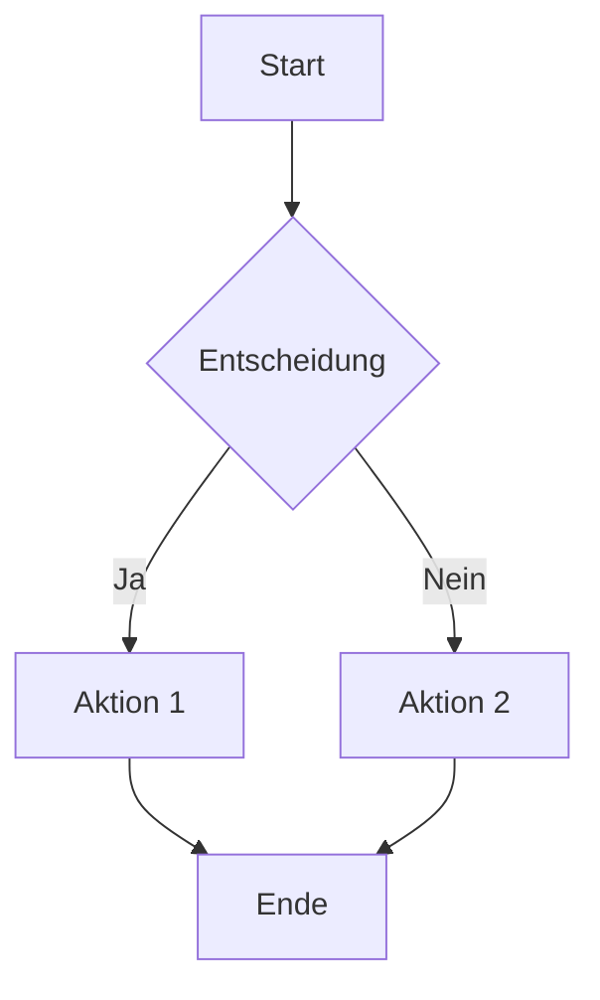
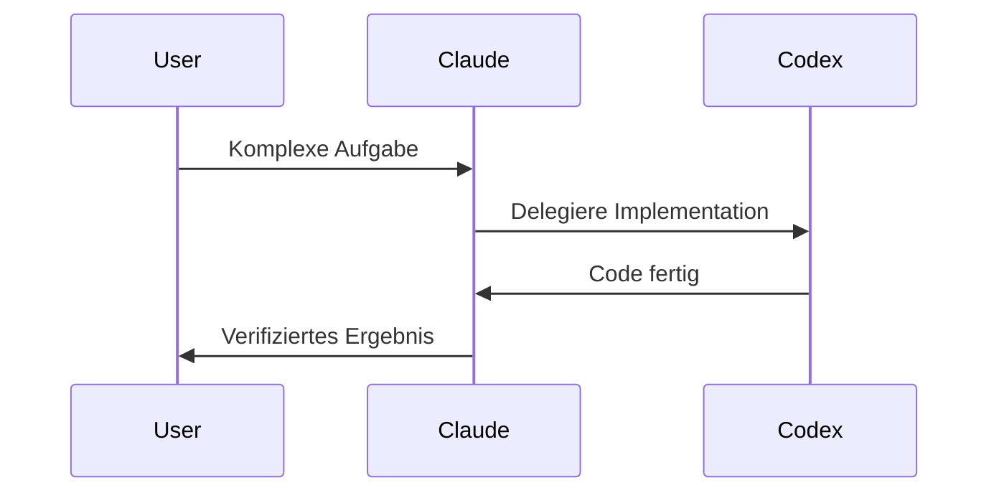
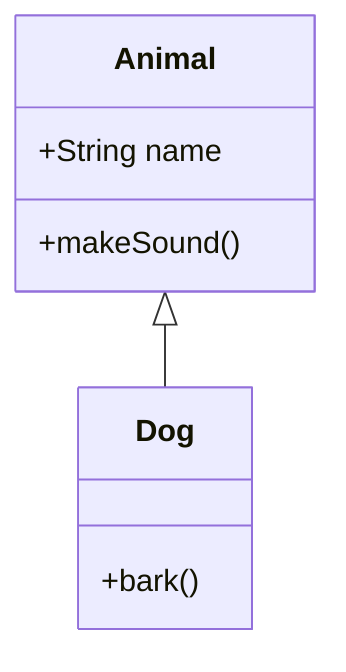

# Claude Artifacts - Vollständige Dokumentation

> Interaktive Inhalte direkt in Claude erstellen

---

## 🎯 Was sind Artifacts?

Artifacts sind **eigenständige, interaktive Inhalte**, die Claude direkt im Chat erstellt und rendert. Sie erscheinen in einem separaten Panel und können:
- Interaktiv sein (React-Komponenten)
- Heruntergeladen werden
- Persistente Daten speichern
- Visualisierungen darstellen

---

## 📁 Unterstützte Dateitypen

### Mit speziellem Rendering

| Typ | Extension | Beschreibung |
|-----|-----------|--------------|
| **Markdown** | .md | Dokumentation, Berichte, formatierter Text |
| **HTML** | .html | Vollständige Webseiten, interaktive Inhalte |
| **React** | .jsx | Interaktive Komponenten mit State |
| **Mermaid** | .mermaid | Diagramme, Flowcharts, Sequenzen |
| **SVG** | .svg | Vektorgrafiken |
| **PDF** | .pdf | Dokumente (via Skills) |

### Allgemeine Dateien

Alle anderen Dateitypen werden erstellt und zum Download angeboten:
- Code-Dateien (.py, .js, .ts, etc.)
- Dokumente (.docx, .xlsx, .pptx)
- Daten (.json, .csv, .xml)
- Konfiguration (.yaml, .toml, .env)

---

## ⚛️ React Artifacts

### Grundstruktur
```jsx
import { useState } from "react";

export default function MyComponent() {
  const [count, setCount] = useState(0);
  
  return (
    <div className="p-4">
      <h1 className="text-2xl font-bold">Counter: {count}</h1>
      <button 
        onClick={() => setCount(c => c + 1)}
        className="bg-blue-500 text-white px-4 py-2 rounded"
      >
        Increment
      </button>
    </div>
  );
}
```

### Verfügbare Bibliotheken

#### React Hooks
```jsx
import { useState, useEffect, useRef, useMemo, useCallback } from "react";
```

#### Lucide React Icons
```jsx
import { 
  Camera, Heart, Star, Search, Menu, X, 
  ChevronDown, ChevronUp, Plus, Minus,
  Check, AlertCircle, Info, Settings
} from "lucide-react";
```

#### Recharts (Diagramme)
```jsx
import { 
  LineChart, Line, BarChart, Bar, PieChart, Pie,
  XAxis, YAxis, CartesianGrid, Tooltip, Legend,
  ResponsiveContainer, Area, AreaChart
} from "recharts";
```

#### D3.js
```jsx
import * as d3 from "d3";
```

#### Three.js (3D)
```jsx
import * as THREE from "three";
// ⚠️ Kein OrbitControls - nutze Alternativen
```

#### Utility Libraries
```jsx
import _ from "lodash";
import * as math from "mathjs";
import * as Tone from "tone";  // Audio
import * as Chart from "chart.js";
```

#### shadcn/ui Komponenten
```jsx
import { Alert, AlertDescription, AlertTitle } from "@/components/ui/alert";
import { Button } from "@/components/ui/button";
import { Card, CardContent, CardHeader } from "@/components/ui/card";
import { Input } from "@/components/ui/input";
import { Label } from "@/components/ui/label";
// ... und viele mehr
```

### Styling mit Tailwind CSS

**Nur Core Utility Classes verwenden!** Kein Tailwind-Compiler verfügbar.

```jsx
// ✅ Gut - Standard Tailwind Classes
<div className="flex items-center justify-between p-4 bg-gray-100 rounded-lg shadow-md">
  <span className="text-lg font-semibold text-gray-800">Title</span>
  <button className="px-4 py-2 bg-blue-500 hover:bg-blue-600 text-white rounded">
    Click
  </button>
</div>

// ❌ Schlecht - Arbitrary Values
<div className="w-[347px] bg-[#1a2b3c]">  // Funktioniert NICHT
```

---

## 💾 Persistent Storage API

### Grundlegende Operationen

```javascript
// Daten speichern (privat)
await window.storage.set('myKey', JSON.stringify(data));

// Daten abrufen
const result = await window.storage.get('myKey');
const data = result ? JSON.parse(result.value) : null;

// Daten löschen
await window.storage.delete('myKey');

// Keys auflisten
const keys = await window.storage.list('prefix:');
```

### Shared Data (öffentlich)

```javascript
// Für alle User sichtbar speichern
await window.storage.set('leaderboard', JSON.stringify(scores), true);

// Shared Data abrufen
const result = await window.storage.get('leaderboard', true);
```

### Best Practices

```javascript
// ✅ Hierarchische Keys verwenden
await window.storage.set('todos:item_123', data);
await window.storage.set('users:user_abc', data);

// ✅ Error Handling
try {
  const result = await window.storage.get('key');
  if (result) {
    // Key existiert
  }
} catch (error) {
  // Key existiert nicht oder Fehler
}

// ❌ NIEMALS localStorage/sessionStorage verwenden!
// Diese APIs sind in Artifacts NICHT verfügbar
```

### Limits

- Keys: Max 200 Zeichen, keine Whitespace/Slashes/Quotes
- Values: Max 5MB pro Key
- Rate Limited - Daten in einzelnen Keys bündeln

---

## 📊 Mermaid Diagramme

### Flowchart


### Sequenzdiagramm


### Klassendiagramm


---

## 🎨 Best Practices

### Wann Artifacts erstellen?

✅ **Erstellen bei:**
- Interaktiven Komponenten/Tools
- Visualisierungen und Diagrammen
- Längeren Dokumenten (>4 Absätze)
- Code der ausgeführt/getestet werden soll
- Inhalten zum Download

❌ **Nicht erstellen bei:**
- Kurzen Antworten
- Einfachen Code-Snippets zur Erklärung
- Listen und Rankings
- Web-Search Ergebnissen

### Design-Prinzipien

1. **Single-File Artifacts** - Alles in einer Datei (HTML+CSS+JS)
2. **Keine externen Abhängigkeiten** außer erlaubten CDNs
3. **Responsive Design** - Funktioniert in verschiedenen Größen
4. **Error Boundaries** - Graceful Degradation bei Fehlern
5. **Loading States** - Feedback während Operationen

### Performance

```jsx
// ✅ Gut - Lazy Loading
const [data, setData] = useState(null);
useEffect(() => {
  loadData().then(setData);
}, []);

// ✅ Gut - Memoization
const expensiveResult = useMemo(() => {
  return computeExpensive(data);
}, [data]);

// ❌ Schlecht - Unnötige Re-Renders
const result = computeExpensive(data); // Bei jedem Render
```

---

## 🔗 Anthropic API in Artifacts

### Claude in Artifacts aufrufen

```javascript
const response = await fetch("https://api.anthropic.com/v1/messages", {
  method: "POST",
  headers: { "Content-Type": "application/json" },
  body: JSON.stringify({
    model: "claude-sonnet-4-20250514",
    max_tokens: 1000,
    messages: [{ role: "user", content: "Dein Prompt" }]
  })
});

const data = await response.json();
const text = data.content[0].text;
```

### Mit Web Search
```javascript
body: JSON.stringify({
  model: "claude-sonnet-4-20250514",
  max_tokens: 1000,
  messages: [...],
  tools: [{ type: "web_search_20250305", name: "web_search" }]
})
```

### Mit MCP Servern
```javascript
body: JSON.stringify({
  model: "claude-sonnet-4-20250514",
  messages: [...],
  mcp_servers: [{
    type: "url",
    url: "https://mcp.service.com/sse",
    name: "service-mcp"
  }]
})
```

---

## 📋 Artifact-Typen Beispiele

### Dashboard (React)
```jsx
export default function Dashboard() {
  const [metrics, setMetrics] = useState([
    { name: "Users", value: 1234, change: "+12%" },
    { name: "Revenue", value: "$45.2k", change: "+8%" },
  ]);
  
  return (
    <div className="grid grid-cols-2 gap-4 p-4">
      {metrics.map(m => (
        <Card key={m.name}>
          <CardHeader>{m.name}</CardHeader>
          <CardContent>
            <div className="text-3xl font-bold">{m.value}</div>
            <div className="text-green-500">{m.change}</div>
          </CardContent>
        </Card>
      ))}
    </div>
  );
}
```

### Interaktives Tool (HTML)
```html
<!DOCTYPE html>
<html>
<head>
  <script src="https://cdn.tailwindcss.com"></script>
</head>
<body class="p-4">
  <div id="app">
    <input type="text" id="input" class="border p-2 rounded">
    <button onclick="process()" class="bg-blue-500 text-white px-4 py-2">
      Process
    </button>
    <div id="output" class="mt-4"></div>
  </div>
  <script>
    function process() {
      const input = document.getElementById('input').value;
      document.getElementById('output').textContent = `Result: ${input}`;
    }
  </script>
</body>
</html>
```

### Datenvisualisierung (React + Recharts)
```jsx
import { LineChart, Line, XAxis, YAxis, Tooltip, ResponsiveContainer } from "recharts";

export default function Chart() {
  const data = [
    { month: "Jan", value: 400 },
    { month: "Feb", value: 300 },
    { month: "Mar", value: 600 },
  ];
  
  return (
    <ResponsiveContainer width="100%" height={300}>
      <LineChart data={data}>
        <XAxis dataKey="month" />
        <YAxis />
        <Tooltip />
        <Line type="monotone" dataKey="value" stroke="#8884d8" />
      </LineChart>
    </ResponsiveContainer>
  );
}
```
